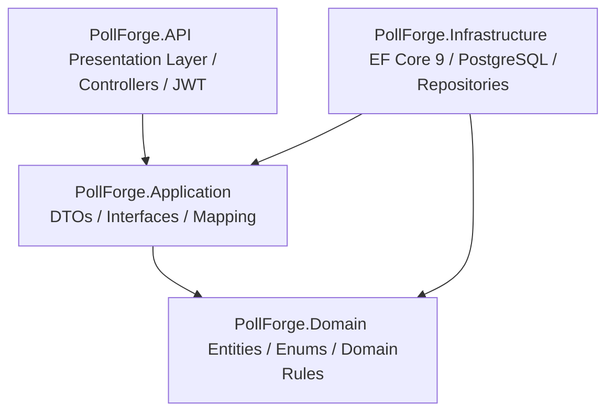

# PollForge 🛡️


**PollForge** is a modern, enterprise-grade polling and voting REST API service engineered with robust **anti-fraud protection** and **device fingerprinting**. Built from the ground up using **.NET 10** and adhering strictly to **Clean Architecture** and **Domain-Driven Design (DDD)** principles.

---

## ✨ Key Features

* 🛡️ **Anti-Fraud & Browser Fingerprinting:** Prevents vote rigging and duplicate submissions by tracking unique device fingerprints and fallback client IP signatures.
* 🏗️ **Clean Architecture:** Strict separation of concerns across Domain, Application, Infrastructure, and Presentation layers, ensuring maintainability and testability.
* 🔒 **JWT Authentication & Authorization:** Secure user onboarding, token-based authentication, and protected poll management operations.
* 📊 **Instant Result Calculation:** Real-time aggregation of voting results with accurate percentage distribution per poll option.
* ⚙️ **Lifecycle Management:** Automated state machine handling poll workflows (`Draft` ➔ `Active` ➔ `Closed`).
* 🐳 **Fully Containerized:** Zero-configuration local deployment using Docker and Docker Compose.

---

## 🏛️ Architecture & Layering

PollForge follows the **Dependency Inversion Principle** where core domain rules never depend on external databases or UI frameworks.



### Layer Breakdown
* **`PollForge.Domain`**: Contains pure domain entities (`Poll`, `Vote`, `User`), validation factories, and repository abstractions. Zero external dependencies.
* **`PollForge.Application`**: Defines use cases, DTO requests/responses, authentication interfaces, and data transformation logic.
* **`PollForge.Infrastructure`**: Implements persistence via Entity Framework Core (PostgreSQL provider), unit of work, and data migrations.
* **`PollForge.API`**: RESTful controllers, global problem details error handling middleware, and dependency injection composition root.

---

## 🚀 Getting Started

### Prerequisites
* [Docker & Docker Desktop](https://www.docker.com/) (Recommended)
* [.NET 10 SDK](https://dotnet.microsoft.com/) (For local development)

### One-Command Startup (Docker Compose)
The easiest way to run the entire backend stack (API + PostgreSQL database) is via Docker Compose:

```bash
# Clone the repository
git clone https://github.com/titsinditsin/PollForge.git
cd PollForge

# Launch API and database containers
docker compose up --build -d
```
The API will be immediately accessible at `http://localhost:8080`.

### Local Development & Testing
To build and run unit tests locally without Docker:

```bash
# Restore dependencies and build solution
dotnet build PollForge.slnx

# Run automated domain & anti-fraud tests
dotnet test PollForge.slnx
```

---

## 📡 API Endpoints Reference

### 🔑 Authentication (`/api/auth`)
| Method | Endpoint | Description | Auth Required |
| :--- | :--- | :--- | :---: |
| `POST` | `/api/auth/register` | Register a new user account | ❌ |
| `POST` | `/api/auth/login` | Authenticate and obtain JWT token | ❌ |

### 📋 Polls (`/api/polls`)
| Method | Endpoint | Description | Auth Required |
| :--- | :--- | :--- | :---: |
| `GET` | `/api/polls?page=1&pageSize=10` | Retrieve paginated list of polls | ❌ |
| `GET` | `/api/polls/{id}` | Get detailed poll information | ❌ |
| `POST` | `/api/polls` | Create a new poll (auto-activates if 2+ options) | ✅ JWT |
| `POST` | `/api/polls/{id}/activate` | Manually activate a draft poll | ✅ JWT |
| `POST` | `/api/polls/{id}/close` | Close an active poll | ✅ JWT |
| `DELETE`| `/api/polls/{id}` | Delete a poll (Author only) | ✅ JWT |

### 🗳️ Voting & Results (`/api/polls/{id}`)
| Method | Endpoint | Description | Auth Required |
| :--- | :--- | :--- | :---: |
| `POST` | `/api/polls/{id}/votes` | Cast a vote (requires `optionId` & `fingerprint`) | ❌ |
| `GET` | `/api/polls/{id}/results` | Get aggregated vote counts and percentages | ❌ |

---

## 🛡️ Anti-Fraud Demonstration

When casting a vote via `POST /api/polls/{id}/votes`:
```json
{
  "optionId": "3fa85f64-5717-4562-b3fc-2c963f66afa6",
  "fingerprint": "browser-hash-883a92f"
}
```
If the same device attempts to vote again in the same poll, the server rejects the request:
```http
HTTP/1.1 409 Conflict
Content-Type: application/problem+json

{
  "status": 409,
  "title": "Already Voted",
  "detail": "A vote has already been cast from this device/fingerprint for this poll."
}
```

---

## 📝 License
This project is licensed under the MIT License. Developed as a showcase of clean engineering and robust backend practices.